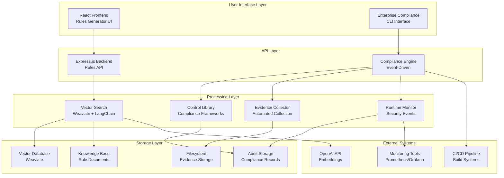
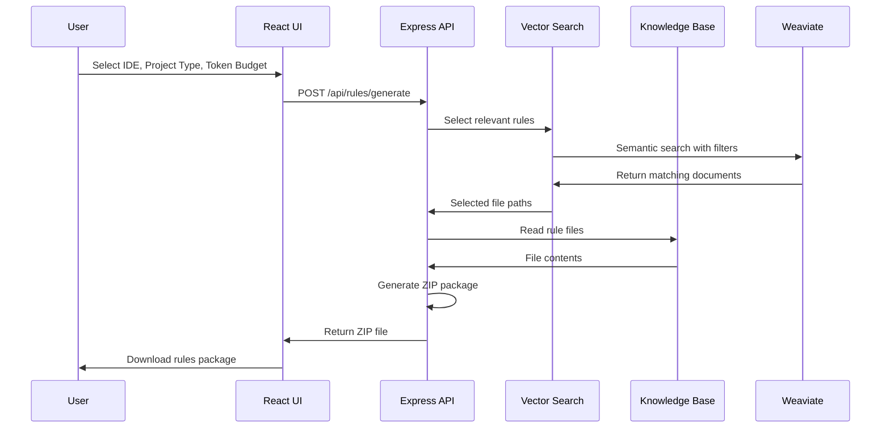
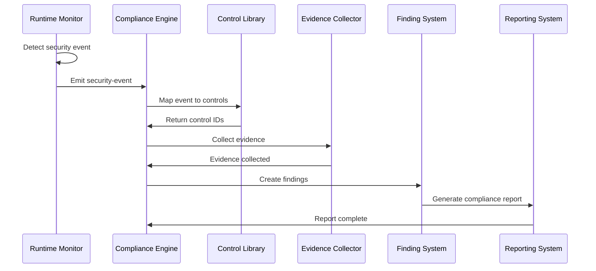
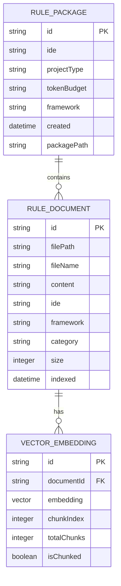
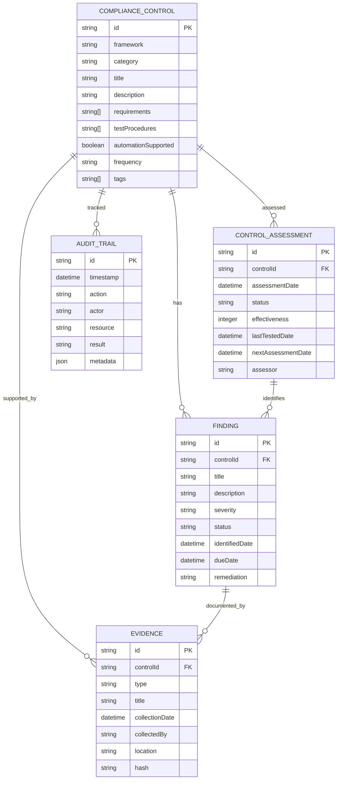
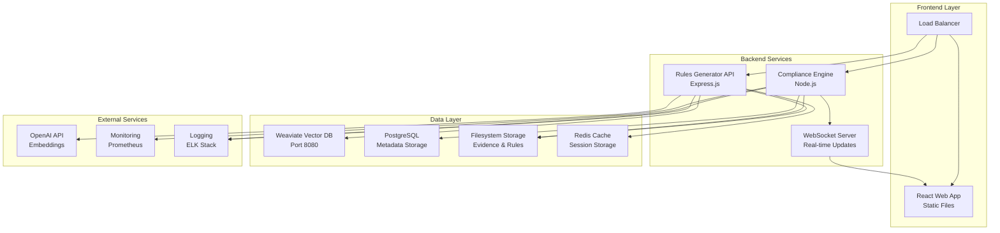
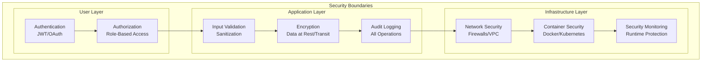

# Architecture Diagram

## System Overview

## Rules Generator Detailed Flow

## Enterprise Compliance Event Flow

## Component Interaction Matrix

| Component | Rules Generator | Compliance Engine | Vector Store | Control Library | Evidence Collector |
|-----------|----------------|------------------|--------------|-----------------|-------------------|
| **React UI** | Direct API calls | - | - | - | - |
| **Express API** | Core logic | - | Semantic search | - | - |
| **Compliance Engine** | - | Event orchestrator | - | Control queries | Evidence requests |
| **Vector Store** | Rule retrieval | - | Core storage | - | - |
| **Control Library** | - | Framework mappings | - | Control definitions | - |
| **Evidence Collector** | - | Evidence storage | - | - | Evidence processing |
| **Runtime Monitor** | - | Event source | - | Control mappings | Automated collection |

## Data Models

### Rules Generator Data Model

### Enterprise Compliance Data Model

## Deployment Architecture

## Security Architecture

This architecture diagram provides a comprehensive visual representation of the system components, their interactions, and the overall structure of both the rules-generator and enterprise-compliance modules.